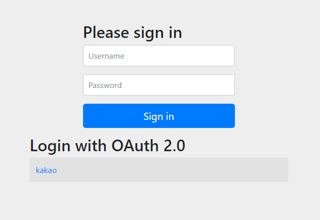
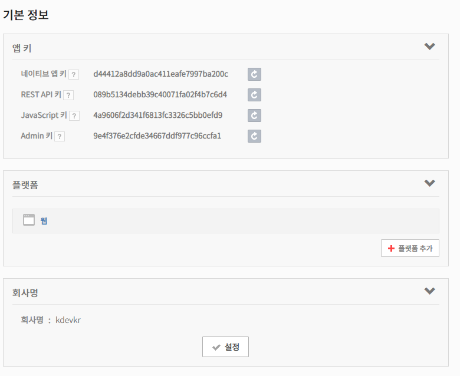
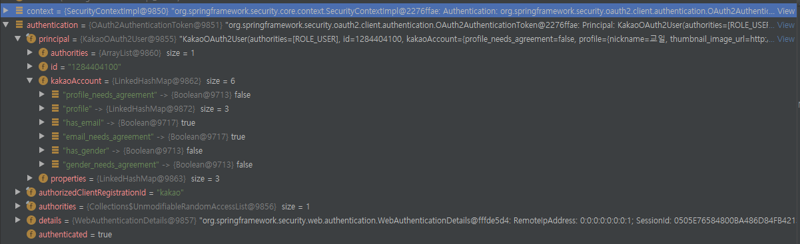

## Web Security OAuth
스프링 시큐리티 5가 릴리즈되면서 [기존의 스프링 소셜 프로젝트는 중단](https://spring.io/blog/2018/07/03/spring-social-end-of-life-announcement)되었습니다. 스프링 소셜 프로젝트에서 제공하던 OAuth 기반 로그인을 구현할 수 있는 많은 부분이 스프링 시큐리티 모듈에 포함됩니다.

> Spring Security OAuth 프로젝트도 중단되었습니다.
> https://projects.spring.io/spring-security-oauth/docs/Home.html

본 예제에서는 스프링 시큐리티에 포함된 OAuth2 부분을 이용하여 카카오로 로그인하기를 구현하는 것을 설명합니다.

다른 OAuth 2.0 공급자에 대한 예제는 [스프링 시큐리티 공식 레퍼런스에서 제공하는 샘플 예제](https://github.com/spring-projects/spring-security/tree/5.2.2.RELEASE/samples/boot/oauth2login)를 참고하십시오.

### OAuth2 모듈
스프링 시큐리티 5.2 부터 다음과 같은 OAuth2 모듈이 포함됩니다. 

- spring-security-oauth2-core.jar
- spring-security-oauth2-client.jar
- spring-security-oauth2-jose.jar
- spring-security-oauth2-resource-server.jar

이 중에서 Core와 Client 모듈을 활용할 예정입니다. 

> 나머지 모듈은 OAuth 2.0 인증 서버 예제에서 활용합니다.

#### Dependenceis
스프링 부트는 OAuth 2.0 로그인을 위한 자동 구성을 제공하므로 기존 Web Security 예제에서 OAuth2 의존성만 추가하면 됩니다.

**build.gradle**
```groovy
dependenceis {
    implementation 'org.springframework.security:spring-security-oauth2-client'
}
```

### OAuth 2.0 로그인
> 본 예제에서는 OAuth에 대한 개념을 다루지 않습니다!
> OAuth에 대한 개념이 없다면 먼저 검색해서 숙지하시기 바랍니다.

#### OAuth 로그인 활성화
OAuth 로그인 기능을 활성화하기 위해서는 HttpSecurity.oauth2Login()를 호출하면 됩니다.

DefaultLoginPageGeneratingFilter에 의해 만들어지는 기본 로그인 페이지에 OAuth 공급자에 대한 로그인 버튼이 만들어집니다.

```java
@Override
protected void configure(HttpSecurity http) throws Exception {
    http.oauth2Login();
}
```

#### 카카오 프로바이더 추가
> [Configuring Custom Provider Properties](https://docs.spring.io/spring-security/site/docs/current/reference/html5/#oauth2login-custom-provider-properties)

카카오같은 국내 OAuth 프로바이더의 경우 스프링 시큐리티가 제공하는 기본 프로바이더 목록에 없으므로 사용자가 개별적으로 추가해야합니다.

application.yml
```yaml
spring:
    security:
      oauth2:
        client:
          registration:
            kakao:
              client-id:
              client-secert:
              redirect-uri: '{baseUrl}/login/oauth2/code/{registrationId}'
              authorization-grant-type: authorization_code
          provider:
            kakao:
              authorization-uri: https://kauth.kakao.com/oauth/authorize
              token-uri: https://kauth.kakao.com/oauth/token
              user-info-uri: https://kapi.kakao.com/v2/user/me
              user-info-authentication-method: POST
```

> 스프링 부트가 spring.security.oauth2.client 프로퍼티 정보를 읽어 프로바이더를 자동으로 추가합니다.
> 또는 직접 [Register a ClientRegistrationRepository @Bean](https://docs.spring.io/spring-security/site/docs/current/reference/html5/#oauth2login-register-clientregistrationrepository-bean)을 참고하여 빈으로 등록할 수 있습니다.

#### 카카오 사용자 프로필 클래스 추가
> [Configuring a Custom OAuth2User](https://docs.spring.io/spring-security/site/docs/current/reference/html5/#oauth2login-advanced-custom-user)

카카오 프로바이더에서 제공하는 사용자 프로필 정보를 위한 OAuth2User 구현체를 만들어야 UserInfoEndpoint에서 인증 정보를 매핑할 수 있습니다.

```java
@Data
public class KakaoOAuth2User implements OAuth2User {
    private List<GrantedAuthority> authorities = AuthorityUtils.createAuthorityList("ROLE_USER");
    private String id;
    @JsonProperty("kakao_account")
    private Map<String, Object> kakaoAccount;
    private Map<String, Object> properties;

    @Override
    public Map<String, Object> getAttributes() {
        Map<String, Object> attributes = new HashMap<>();
        attributes.putAll(kakaoAccount);
        attributes.putAll(properties);
        return attributes;
    }

    @Override
    public Collection<? extends GrantedAuthority> getAuthorities() {
        return authorities;
    }

    @Override
    public String getName() {
        return this.id;
    }
}
```

그리고 UserInfoEndpoint에서 kakao 프로바이더가 제공하는 사용자 유형 클래스가 KakaoOAuth2User라고 제공합니다.

```java
http.oauth2Login(
oauth2Login -> oauth2Login.userInfoEndpoint(
    userInfoEndpoint -> userInfoEndpoint.customUserType(KakaoOAuth2User.class, "kakao")));
```

#### 카카오 계정으로 로그인하기
카카오 계정으로 로그인하기 버튼을 만들어 사용자에게 제공해야하지만 지금은 예제이므로 스프링 시큐리티가 자동으로 만들어주는 로그인 페이지를 통해 카카오 계정으로 로그인해보겠습니다.



혹시 로그인이 안되시나요? 여러분의 카카오 애플리케이션 정보를 확인해야합니다. 정확한 클라이언트 아이디를 입력했는지, 인증 시 리다이렉트되는 URI가 일치하는지 말입니다.



> 해당 키들은 갱신하였기에 사용할 수 없습니다. :)


성공적으로 인증된 경우에는 SecurityContextHolder를 통해 인증된 사용자에 대한 정보에서 확인할 수 있습니다.



#### 카카오 계정으로부터 토큰 발급
OAuth로 인증된 사용자는 OAuth2AuthenticationToken 유형의 Principal이며 OAuth2AuthorizedClientService를 이용하여 인증된 사용자의 정보를 활용해서 액세스 토큰과 리프래쉬 토큰을 가져올 수 있습니다.

```java
@RestController
public class UserApi extends BaseApi {
    private final OAuth2AuthorizedClientService authorizedClientService;

    public UserApi(OAuth2AuthorizedClientService authorizedClientService) {
        this.authorizedClientService = authorizedClientService;
    }

    @GetMapping("/users/me/token")
    public ResponseEntity<Object> currentUserToken(@AuthenticationPrincipal Principal principal) {
        if(principal instanceof OAuth2AuthenticationToken) {
            Map<String, Object> attributes = new HashMap<>();
            OAuth2AuthenticationToken oAuth2AuthenticationToken = (OAuth2AuthenticationToken) principal;
            
            OAuth2AuthorizedClient oAuth2AuthorizedClient = authorizedClientService.loadAuthorizedClient(oAuth2AuthenticationToken.getAuthorizedClientRegistrationId(), oAuth2AuthenticationToken.getName());
            OAuth2AccessToken accessToken = oAuth2AuthorizedClient.getAccessToken();
            OAuth2RefreshToken refreshToken = oAuth2AuthorizedClient.getRefreshToken();

            attributes.put("name", oAuth2AuthenticationToken.getName());
            attributes.put("accessToken", accessToken);
            attributes.put("refreshToken", refreshToken);
            return ResponseEntity.ok(attributes);
        }

        return ResponseEntity.ok(principal);
    }
}
```

> 어떠신가요? 스프링 시큐리티가 다해주니까 참 쉽죠?

## 참고
- [OAuth2 - Spring Security](https://docs.spring.io/spring-security/site/docs/5.2.2.RELEASE/reference/html5/#oauth2)
- [카카오 REST API 개발가이드](https://developers.kakao.com/docs/restapi)