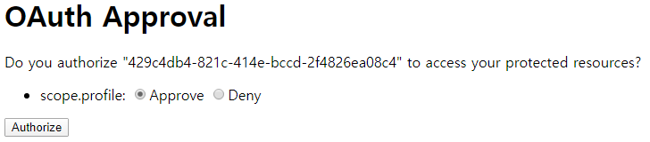
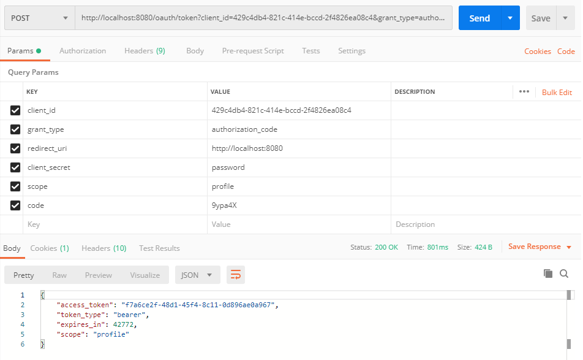
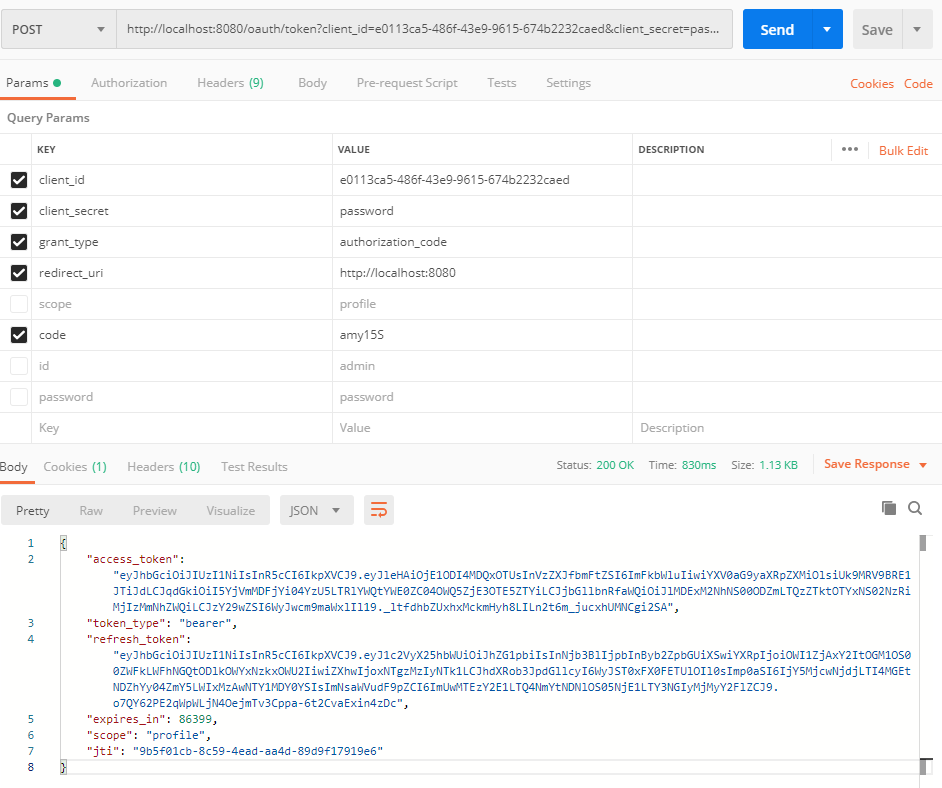

## Web Security OAuth Server
Spring Security OAuth 프로젝트는 더이상 업데이트되지 않으며 이제 OAuth 2.0은 스프링 시큐리티에서 제공합니다. 

다만, 스프링 시큐리티를 통한 OAuth 2.0 구성에 대한 문서는 아직 업데이트되지 않았으므로 [OAuth 2 Developers Guide](https://projects.spring.io/spring-security-oauth/docs/oauth2.html)와 [OAuth 2.0 Migration Guide](https://github.com/spring-projects/spring-security/wiki/OAuth-2.0-Migration-Guide)를 참고하여 구성해야합니다.

국내 개발자들이 OAuth 2.0 시스템에 대한 구성을 쉽게 이해할 수 있도록 [카카오 REST API 개발가이드](https://developers.kakao.com/docs/restapi)를 참고하여 OAuth 2.0 서버를 구현해보도록 하겠습니다.

### OAuth 2.0 Spectification
스프링 시큐리티는 OAuth 2.0 표준 스펙에 따라 권한 및 리소스 서버를 구현할 수 있도록 지원합니다.
- [RFC 6749 - The OAuth 2.0 Authorization Framework](https://tools.ietf.org/html/rfc6749)  
- [OAuth 2.0](https://oauth.net/2/)  

다음은 OAuth 2.0 스펙과 카카오 OAuth2 로그인 시 활용되는 항목을 비교한 표입니다.

|카카오 OAuth2|OAuth 2.0 Spectification|
|---|---|
|앱 키|client_id|
|Client Secret|client_secret|
|로그인 동의 항목|scope|
|로그인 Redirect URI|redirect_uri|

### Authorization Server
인증 서버는 [OAuth Grant Types](https://oauth.net/2/grant-types/)에 따라 클라이언트가 보호된 리소스에 대한 자격 증명인 액세스 토큰을 부여하는 과정을 담당 합니다.

일반적으로 인증에는 다음과 같은 유형이 있습니다.
- Authorization Code
- Client Credentials
- Implicit
- Resource Owner Password Credentials

예를 들어, 카카오 OAuth2 로그인은 Authorization Code 유형으로 자격 증명(액세스 토큰 또는 리프래쉬 토큰)을 얻는 과정을 수행합니다. 

스프링 시큐리티에서는 `AuthorizationEndpoint`가 Authorization Code 유형으로 자격 증명을 얻기 위한 인증 코드를 발급하는 것을 담당합니다. 이 엔드포인트는 아주 간단하게 `@EnableAuthorizationServer`로 OAuth 2.0 인증 서버 매커니즘을 적용하면 추가할 수 있습니다.

```java
@EnableAuthorizationServer
@Configuration
public static class AuthorizationServerConfig extends AuthorizationServerConfigurerAdapter {
    @Override
    public void configure(AuthorizationServerSecurityConfigurer security) {
        // 토큰 엔드포인트에 대한 보안 제한 조건을 정의합니다.
    }

    @Override
    public void configure(ClientDetailsServiceConfigurer clients) throws Exception {
        // 클라이언트 정보를 초기화하거나 저장하는 클라이언트 디테일 서비스를 구성
    }

    @Override
    public void configure(AuthorizationServerEndpointsConfigurer endpoints) {
        // 권한 부여 그리고 토큰 엔드포인트와 토큰 서비스를 정의합니다.
    }
}
```

#### ClientDetailsServiceConfigurer
OAuth2 인증 과정에서 필요한 클라이언트 정보를 수립하는 것을 담당합니다. 예를 들어, 카카오 애플리케이션에서는 앱키에 해당하는 정보를 만들어내는 과정입니다.

##### 클라이언트 정보 구성
OAuth 클라이언트 정보는 다음과 같이 구성됩니다.

- ClientId: (필수) 클라이언트 아이디
- secret: (신뢰된 클라이언트인 경우) 클라이언트 시크릿
- scope: 클라이언트의 제한된 스코프 범위
- authorizedGrantTypes: 클라이언트가 사용할 수 있는 인증 유형
- authorities: 클라이언트에 부여된 권한

> 이 클라이언트 정보는 ClientDetailsManager 인터페이스를 통해 생성하거나 JDBC와 같은 저장소를 활용할 수 있습니다.

다음은 사용자 정의된 `ClientDetailsService`를 적용하는 예시입니다.
```java
@Service
public class ClientService implements ClientDetailsService {

    private List<Client> clients;

    public ClientService() throws IOException {
        loadClients();
    }

    private void loadClients() throws IOException {
        Gson gson = new Gson();
        ClassPathResource classPathResource = new ClassPathResource("db/client.json");
        String clientsJson = StreamUtils.copyToString(classPathResource.getInputStream(), StandardCharsets.UTF_8);
        this.clients = gson.fromJson(clientsJson, new TypeToken<List<Client>>(){}.getType());
    }

    @Override
    public ClientDetails loadClientByClientId(String clientId) throws ClientRegistrationException {

        if(clients != null) {
            for (Client client : clients) {
                if (client.getClientId().equals(clientId)) {
                    return client;
                }
            }
        }

        return null;
    }
}

@Override
public void configure(ClientDetailsServiceConfigurer clients) throws Exception {
    clients.withClientDetails(clientService);
}
```

**db/client.json**
다음의 JSON은 두 개의 클라이언트 정보를 구성하고 있습니다.
```json
[
  {
    "name": "client_1",
    "clientId": "e0113ca5-486f-43e9-9615-674b2232caed",
    "clientSecret": "$2a$12$ry/T4SyQyiNpaWbadf9sne3Cko..q92Oh2klkCMv4XB1qG6cy8iaG",
    "authorizedGrantTypes": "authorization_code, client_credentials, refresh_token",
    "registeredRedirectUri": "http://localhost:8080",
    "accessTokenValidity": 86400,
    "refreshTokenValidity": 604800
  },
  {
    "name": "client_2",
    "clientId": "429c4db4-821c-414e-bccd-2f4826ea08c4",
    "clientSecret": "$2a$12$ry/T4SyQyiNpaWbadf9sne3Cko..q92Oh2klkCMv4XB1qG6cy8iaG",
    "authorizedGrantTypes": "authorization_code, implicit, client_credentials",
    "registeredRedirectUri": "http://localhost:8080",
    "accessTokenValidity": 86400
  }
]
```

그리고 이 클라이언트 정보를 표현하는 ClientDetails를 구현합니다.

```java
@Data
public class Client implements ClientDetails {

    private String name;

    private String clientId;
    private String clientSecret;
    private String authorities;
    private String scope;
    private String authorizedGrantTypes;
    private String resourceIds;
    private Integer accessTokenValidity;
    private Integer refreshTokenValidity;
    private String autoApprove;
    private String additionalInformation;
    private String registeredRedirectUri;

    @Override
    public String getClientId() {
        return this.clientId;
    }

    @Override
    public Set<String> getResourceIds() {
        if(this.resourceIds == null) {
            return Collections.emptySet();
        }
        return new HashSet<>(Arrays.asList(resourceIds.split(",")));
    }

    @Override
    public boolean isSecretRequired() {
        return this.clientSecret != null;
    }

    @Override
    public String getClientSecret() {
        return this.clientSecret;
    }

    @Override
    public boolean isScoped() {
        return this.scope != null;
    }

    @Override
    public Set<String> getScope() {
        Set<String> scopes = new HashSet<>();
        if(this.scope == null) {
            scopes.add("all");
        } else {
            scopes =  Arrays.stream(scope.split(",")).map(String::trim).collect(Collectors.toSet());
        }
        return scopes;
    }

    @Override
    public Set<String> getAuthorizedGrantTypes() {
        if(this.authorizedGrantTypes == null) {
            return Collections.emptySet();
        }
        return Arrays.stream(authorizedGrantTypes.split(",")).map(String::trim).collect(Collectors.toSet());
    }

    @Override
    public Set<String> getRegisteredRedirectUri() {
        if(registeredRedirectUri == null) {
            return Collections.emptySet();
        }
        return Arrays.stream(registeredRedirectUri.split(",")).map(String::trim).collect(Collectors.toSet());
    }

    @Override
    public Collection<GrantedAuthority> getAuthorities() {
        if(this.authorities == null) {
            return Collections.emptyList();
        }
        return Arrays.stream(this.authorities.split(",")).map(authority -> (GrantedAuthority) authority::trim).collect(Collectors.toSet());
    }

    @Override
    public Integer getAccessTokenValiditySeconds() {
        return this.accessTokenValidity;
    }

    @Override
    public Integer getRefreshTokenValiditySeconds() {
        return this.refreshTokenValidity;
    }

    @Override
    public boolean isAutoApprove(String scope) {
        return false;
    }

    @Override
    public Map<String, Object> getAdditionalInformation() {
        return null;
    }
}
```

이로써 자격 증명을 가져오기 위한 인증 서버에 대한 구현이 완료되었습니다.

이제 브라우저를 통해 카카오 로그인 연동하기 처럼 인증 프로세스를 진행해보겠습니다.

### Authorization Process

#### /oauth/authorize
기본적인 인증 엔드포인트의 URL은 `/oauth/authorize`입니다.

- client_id : 발급된 클라이언트 아이디
- response_type : `code` 또는 `token`
- redirect_uri : 사용자 인증 후 이동될 리다이렉션 URI

response_type에 따라서 code인 경우 Authorization Code 인증을 진행하여 redirect_uri로 제공되는 파라미터는 인증 코드입니다. 반면에 token인 경우 Implicit 인증을 진행하여 redirect_uri로 제공되는 파라미터는 자격 증명 정보입니다.

제가 발급한 클라이언트 정보는 다음과 같습니다.

- client_id : 429c4db4-821c-414e-bccd-2f4826ea08c4
- response_type : code
- redirect_uri : http://localhost:8080

위 정보에 따라 http://localhost:8080/oauth/authorize?client_id=429c4db4-821c-414e-bccd-2f4826ea08c4&response_type=code로 인증 요청을 하게 되면 인증 서버는 로그인 페이지를 제공하여 사용자의 신원을 확인합니다.

> 카카오톡 로그인 연동 시 제공되는 로그인 페이지와 같습니다.

로그인되어 신원이 확인된 사용자는 해당 클라이언트가 요청한 스코프를 확인하여 최종 처리합니다.

> 카카오톡 로그인 시 개인정보 동의 항목을 선택하는 화면과 같습니다.
> 다만, 프로필 항목을 필수로 선택되어지게 제한을 한 것 이죠



사용자가 어떤 권한을 제공할지 선택했으면 인증 서버는 redirect_uri로 인증 코드 또는 토큰을 발급하여 응답합니다.

저는 http://localhost:8080/?code=9ypa4X 이렇게 제공받았습니다.

그리고 응답받은 인증 코드를 이용하여 다시 자격 증명을 요청합니다.

#### /oauth/token
토큰 엔드포인트는 자격 증명을 얻기위한 프로세스를 담당하여 처리합니다.

- client_id : 클라이언트 아이디
- client_secret : 클라이언트 시크릿
- scope : 사용자가 동의한 항목 중에서 자격 증명에 포함될 항목
- code : 인증 코드



성공적으로 인증되었으면 위와 같이 자격 증명(액세스 토큰)이 발급되었을 것입니다.

> 리프래쉬 토큰은 왜 없냐구요? 제가 클라이언트 정보를 발급할 때 리프래쉬 토큰 부여 권한을 제공하지 않았기 때문입니다.

이제 OAuth 2 리소스 서버로 자격 증명을 이용하여 요청하면 됩니다.

### JWT(JSON Web Token)  
스프링 시큐리티는 OAuth로 발급하는 토큰을 JWT로 변경하는 것이 유연합니다.

> 저는 JWT를 사용하지 않기 때문에 개념적인 부분을 설명하지 않습니다. 
> 개념적인 부분은 검색 또는 다음 글들을 참고바랍니다.
> - [REST JWT(JSON Web Token)소개](https://bcho.tistory.com/999)
> - [JSON Web Token(JWT)](https://blog.outsider.ne.kr/1069)
> - [JWT를 구현하면서 마주치게 되는 고민들](https://swalloow.github.io/implement-jwt)

#### Dependencies

```groovy
implementation 'org.springframework.security:spring-security-oauth2-jose'
```

#### JWT를 위한 설정
JWT가 포함된 의존성이 추가되었으면 스프링 시큐리티의 OAuth 서버가 일반 토큰 대신에 JWT를 사용할 수 있도록 몇가지 설정만 하면 됩니다.

```java
@Bean
public JwtAccessTokenConverter accessTokenConverter() {
    JwtAccessTokenConverter accessTokenConverter = new JwtAccessTokenConverter();
    accessTokenConverter.setSigningKey("password");
//  accessTokenConverter.setKeyPair();
    return accessTokenConverter;
}

@Bean
public TokenStore tokenStore() {
    return new JwtTokenStore(accessTokenConverter());
}

@Bean
@Primary
public DefaultTokenServices tokenServices() {
    DefaultTokenServices tokenServices = new DefaultTokenServices();
    tokenServices.setTokenStore(tokenStore());
    tokenServices.setClientDetailsService(clientService);
    tokenServices.setSupportRefreshToken(true);
    return tokenServices;
}
```

> 예제에서는 토큰 발급시 사용되는 키를 평문으로 지정하였으나 실제 애플리케이션에서는 RSA 또는 HMAC 방식으로 구성하시기 바랍니다.

JWT를 사용하는 TokenStore, AccessTokenConverter, TokenServices를 만들었으면 OAuth 인증 또는 자원 서버에서 이를 사용하도록 지정하면 됩니다. 
```java
@Override
public void configure(AuthorizationServerEndpointsConfigurer endpoints) {
    endpoints
        .authenticationManager(authenticationManager)
        .accessTokenConverter(accessTokenConverter())
        .tokenStore(tokenStore());
}

@Override
public void configure(ResourceServerSecurityConfigurer resources) {
    resources
        .authenticationManager(authenticationManager)
        .tokenStore(tokenStore)
        .tokenServices(tokenServices);
}
```

다시 OAuth 인증 프로세스를 거쳐 액세스 토큰을 요청하면 다음과 같이 JWT로 발급합니다.



## 참고
- [OAuth 2 Developers Guide](https://projects.spring.io/spring-security-oauth/docs/oauth2.html)
- [Introduction to JSON Web Tokens](https://jwt.io/introduction/)
