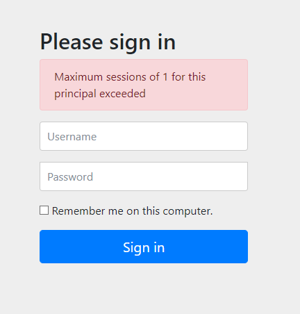

## Web Security Session
본 프로젝트에서는 스프링 시큐리티 모듈과 스프링 세션 모듈의 통합을 설명합니다.

- Spring Security 5.2.2.RELEASE
- Spring Boot 2.2.4.RELEASE
- Spring Data Redis 2.2.4.RELEASE
- Spring Session Core 2.2.0.RELEASE

### SessionConfig
세션 관련 설정을 통합하여 관리합니다.

#### HttpSessionConfig
@EnableRedisHttpSession를 선언하여 RedisHttpSessionConfiguration을 빈으로 등록합니다.

> 만약, RedisHttpSessionConfiguration를 확장하려면 @EnableRedisHttpSession를 제거하시기 바랍니다.

```java
@EnableRedisHttpSession
@Configuration(proxyBeanMethods = false)
public static class HttpSessionConfig {}
```

### SecurityConfig
스프링 시큐리티 설정을 통해 몇가지 세션 관련 기능을 통합합니다.

#### Remember-me  
스프링 세션은 스프링 시큐리티의 리멤버-미 인증과의 통합을 제공합니다.

```java
// SessionConfig
@Bean
public SpringSessionRememberMeServices rememberMeServices() {
    SpringSessionRememberMeServices rememberMeServices = new SpringSessionRememberMeServices();
    rememberMeServices.setAlwaysRemember(true);
    return rememberMeServices;
}

// SecurityConfig.WebSecurityConfig
@Override
protected void configure(HttpSecurity http) throws Exception {
    http.rememberMe()
            .rememberMeServices(rememberMeServices);
}
```

#### Concurrent Session Control  
스프링 세션은 스프링 시큐리티와 함께 동시 세션 제어를 지원합니다.

```java
// SessionConfig
@Bean
public SpringSessionBackedSessionRegistry sessionRegistry() {
    return new SpringSessionBackedSessionRegistry<>(sessionRepository);
}

// SecurityConfig.WebSecurityConfig
@Override
protected void configure(HttpSecurity http) throws Exception {
    http.sessionManagement()
            .maximumSessions(1)
            .sessionRegistry(sessionRegistry);
}
```

만약, 두개 이상의 브라우저에서 접속을 시도하면 이전 세션 정보는 만료됩니다.

```sh
This session has been expired (possibly due to multiple concurrent logins being attempted as the same user).
```


### 사용자 정의 기능 구현

#### 동시 세션 인증 제한하기
최대 세션 수를 넘어가는 경우 이전에 인증된 세션을 만료합니다. 만약, 인증된 세션을 만료시키지 않고 인증 자체를 허용하지 않도록 maxSessionsPreventsLogin 여부로 설정할 수 있습니다.

```java
http.sessionManagement()
    .maximumSessions(1)
    .maxSessionsPreventsLogin(true)
    .sessionRegistry(sessionRegistry);
```

위 설정에 따르면 최대 세션 수가 1이므로 이미 인증된 세션이 존재하면 인증 요청이 허용되지 않습니다.



## 참고
- [Spring Session](https://docs.spring.io/spring-session/docs/2.2.0.RELEASE/reference/html5/)
- [Spring Data Redis](https://docs.spring.io/spring-data/data-redis/docs/2.2.4.RELEASE/reference/html/#)